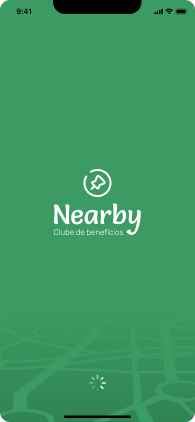
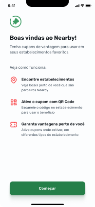
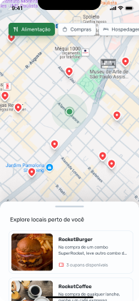

# Nearby 🗺️

## Sobre ℹ️
Um aplicativo móvel que consiste em mostrar serviços perto de sua localização. Feito no evento de NLW Pocket Mobile da [Rocketseat](https://app.rocketseat.com.br/login?to=/), trilha React Native.

## Tecnologias 🛠️

